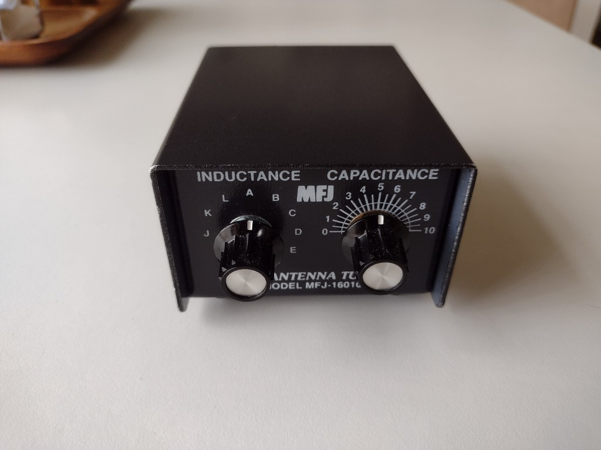
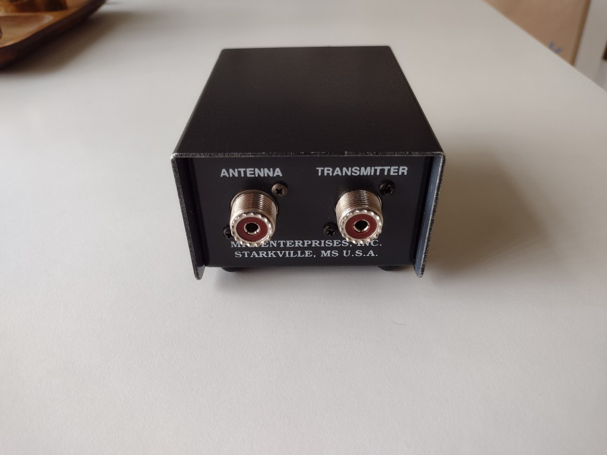
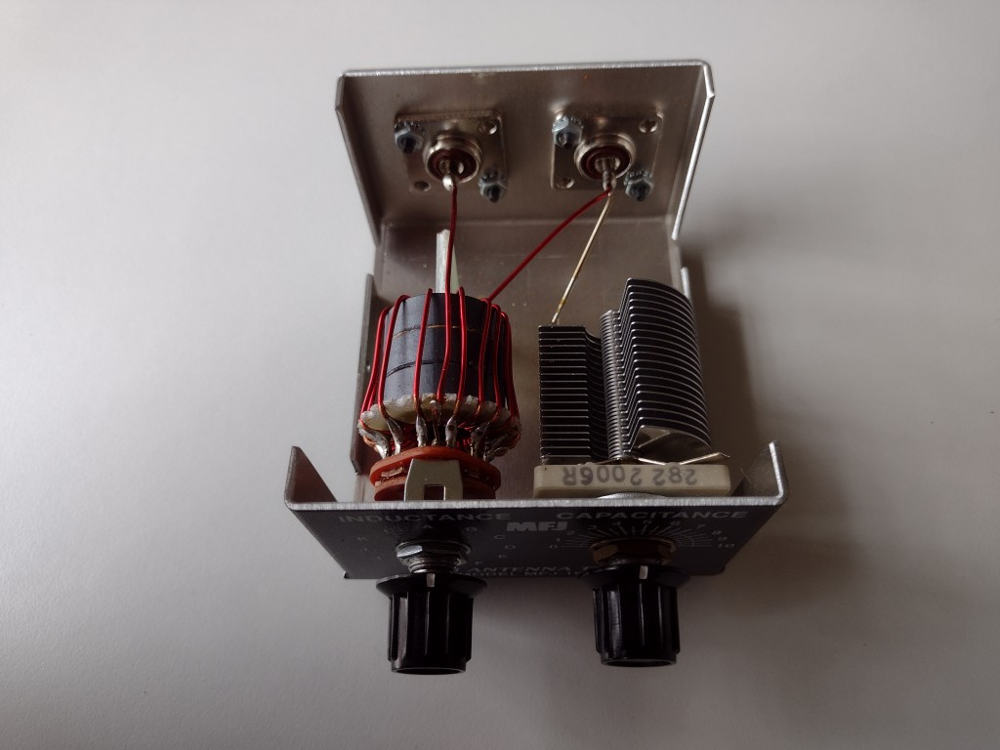
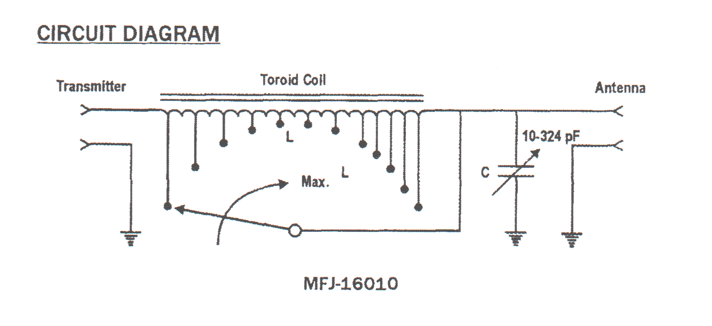
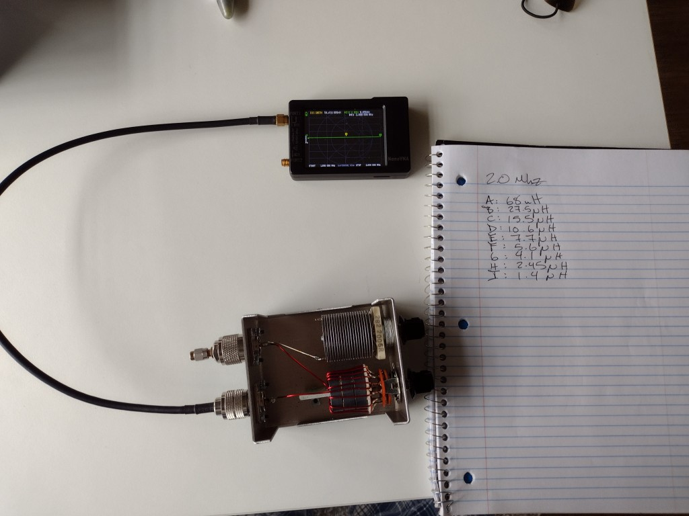
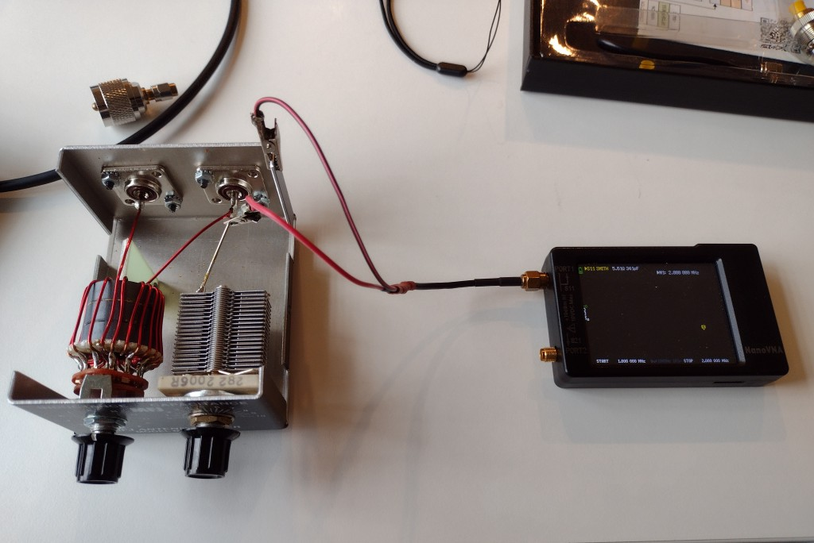
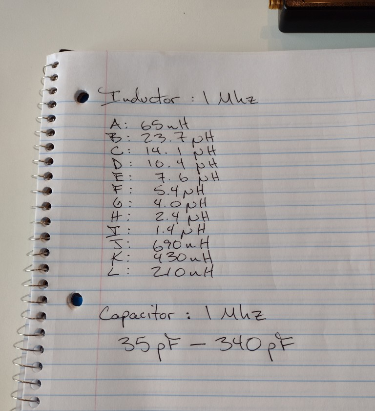

# CS& 141 Final Project
L-Network Antenna Tuner Simulator

## Description

This program implements a simple simulation of the operation of an L-Network antenna tuner, commonly
used by amateur (ham) radio operators like myself. These devices are used to match the impedance of an antenna to
the output impedance of a transmitter, maximizing power transfer and minimizing reflected power, which causes feed
line losses and can damage equipment at higher power levels. The device consists of a series inductor and parallel 
capacitor and has an input and output port where it can be inserted into a coaxial antenna cable feed line. The most 
common measure of impedance matching in ham radio is Standing Wave Ratio (SWR) which is calculated from reflection 
coeffiecient (also know as Gamma) as described below. This program will calculate SWR for a given matching network 
configuration and antenna impedance.

The device this project primarily attempts to model is the MFJ-16010. The photos here show the external ports and controls
as well as the internal components: the switched inductor and air-variable capacitor. A schematic of the circuit is
included as well. 

   

### Calculations

Several calculations are required in the program. For both the capacitor and inductor, the reactive (imaginary) component of impedance 
must be found. Reactance is frequency-dependent. This reactance of a capacitor is: 

$$X_c = -\dfrac{1}{2\pi fC}$$

And the reactance of and inductor is:

$$X_L = 2\pi fL$$

The negative sign assigns capacitive reactance to values below the x-axis.

SWR, which is our preferred metric of antenna match is calculated from the reflection coefficient $\Gamma $. The value 
of $\Gamma$ is calculated from antenna or tuner input port impedance compared to a 
nominal system impedance $Z_o$ which in most amateur systems is 50+j0 $\ohm $.

$$SWR = \dfrac{1 +  |\Gamma |}{1 - |\Gamma |}$$

where

$$\Gamma = \dfrac{Z_L - Z_o}{Z_L + Z_o}$$

Series and parallel impedances are using calculated using the properties that series impedances add and parallel impedances
add via reciprocals.

### Configuration File

The instruction manual for the unit does not specify any component values for the inductor. I was able to get reasonable 
measurements of the component values using a <a href="https://nanovna.com/">NanoVNA</a> handheld vector network
analyzer. 

  

These values were added to the config file <a href="tuner.cfg">tuner.cfg</a>

## Dependencies

This program makes use of a complex number class from:

https://github.com/vmicelli/jcomplex/blob/master/src/main/java/com/vm/jcomplex/Complex.java

It is a derivative work of the Apache commons library with the same license.

## Configuration

The program configuration is specified in a file with the default name of: tuner.cfg but this can be 
overriden on the command line by specifiying a file as the first program argument: java Tuner myfile.cfg

The configuration file has several different configuration options that operate as follows:

CAPACITOR A.AA B.BB

This parameter defines the range of capacitance values in decimal picofarads that the capacitor provides with A for the low capacitance and B for the high.

INDUCTOR C.CC D.DD E.EE F.FF

This parameter defines a tapped inductor with a list of values in decimal microhenries that are available to be selected by a switch. Up to 16 switch positions
are supported.

ANTENNA G.G H.H

The complex impedance of the antenna is specified with the real component as G.G and the imaginary as H.H

FREQUENCY M.MMM

The frequency of operation in Megahertz.

HIGHPASS [0|1]

This boolean parameter sets whether or not the network is configured as low-pass (default) or high-pass. In the former situation
the antenna impedance is greater than the source impedance. In the second situation the antenna impedance is less than the source
impedance and the coaxial input/output connections are reversed to properly match the systems.

## Execution

Upon program execution, the configuration file is read and the user is presented with a command prompt. 
Pressing '?' [enter] will display a list of commands.

* c <x.x> : simulate turning the capacitor know to a certain value (must be in the range configured)
* f <x.xxx> : set frequency in megahertz
* i <X|x.x> : simulate rotating the inductor switch to choose inductance value by letter or in microhenries (must be one of the values configured)
* o : show the current config and knob settings
* q : quit
* s : calculate SWR for the current knob settings

The o command will show the current configuration of the simulator. The values of the inductor can be changed with the i command. 
A specific inductance value can be set as a decimal or a tap can be chosen by letter. The capacitance can be set using the c command
with a decimal value argument. Frequency of operation can be set using the f command with a decimal value in megahertz. The s command
will calculate a tuned input impedance for the network and display the resultant SWR.

Acceptable values of SWR are usually < 2.0 and ideally < 1.5 with a perfect match indicated by 1.0.

## Sample Output
<pre>
cmd> o

Network Parameters:

Frequency: 28.4 Mhz
Antenna Impedance: (100.0, 20.0)
Capacitor Range: 35.0 pF --> 340.0 pF
Inductor Taps: A:0.065 µH, B:23.7 µH, C:14.1 µH, D:10.4 µH, E:7.6 µH, F:5.4 µH, G:4.0 µH, H:2.4 µH, I:1.4 µH, J:0.69 µH, K:0.43 µH, L:0.21 µH
High Pass: false

Current Settings:

Inductor: 0.065 µH
Capacitor: 170.0 pF

cmd> s

Untuned:

Antenna: 100.0 + j20.0 Ω
SWR: 2.1

Tuned:

Input: 51.7 - j14.5 Ω
SWR: 1.3
</pre>

## Repository

* LNetwork.java - Implementation of the tuning network
* Tuner.java - A command-line interface tuner simulator
* test-calculations.py - some prototype calculations using native python complex number support used during development and testing
* Complex.java - A complex number library based on the Apache commons Complex class
* tuner.cfg - a configuration file for the MFJ-16010 device

Documentation for the LNetwork class is available in Javadoc format and can be built by running <code>make doc</code> in the source tree.

## Testing

At present the software has no automated test cases. Limited manual testing was performed by comparing output of the program to values 
calculated in the SimSmith program as show in this screenshot.

## Notes

Some of the challenges encountered in this project were:

* Spent significant time on non-coding research tasks like finding the right equations and experimentally determining inductor values.
* I ended up switching to a different Complex number implementation in the middle of the project because after more careful inspection it did not seem to have an open source license.
* Lot of time debugging with print statements. I need to learn to use the Java debugger.
* Had to cut scope a little for this release when I determined I didn't have time to implement all the features I had initially planned.

Next steps:

* Would like to be able to build the code using Java-centric build tools and link against apache-commons library. Need to read up on it.
* Next things I would like to implement are an auto-tuning routine to find an optimal match.

## Sources and Citations

1. <a href="https://eng.libretexts.org/Bookshelves/Electrical_Engineering/Electronics/Microwave_and_RF_Design_III_-_Networks_(Steer)/06%3A_Chapter_6">LibreTexts Microwave and RF Design III</a> 
Good information on L-networks with many design equations.

2. <a href="https://en.wikipedia.org/wiki/Reflection_coefficient">Wikipedia: Reflection Coefficient</a> Calculations for SWR and reflection coefficient.

3. <a href="https://baltic-lab.com/2013/04/l-network-impedance-matching/">L-Network Matching</a> A little bit simpler explanation and presentation of the L-network calculations.

4. <a href="https://en.wikipedia.org/wiki/Electrical_reactance">Wikipedia: Electrical Reactance</a> Formulas for reactance.

5. <a href="simsmith">SimSmith</a> Great program for network modeling. Used to verify my calculations produced similar results.

6. <a href="https://docs.oracle.com/javase/8/docs/technotes/tools/windows/javadoc.html">Javadoc</a> Reference for Javadoc comment format.

7. <a href="https://www.markdownguide.org/basic-syntax">Markdown Guide</a> Reference for markdown.

8. <a href="https://ashki23.github.io/markdown-latex.html">Markdown LaTeX Introduction</a> Reference for writing math formulas in README.md.
